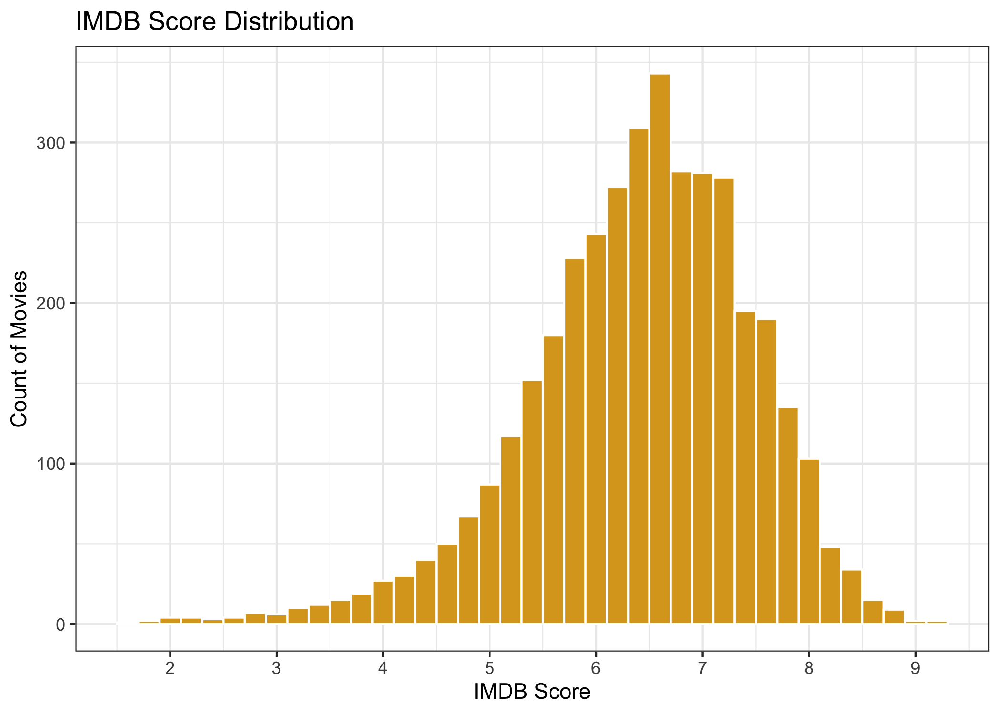

## STA 9750 Final Project


## Introduction

Many factors such as user reviews, budget of the movie, actor's and director's popularity etc play role in making a movie successful. IMDB is the world's most popular database designed to help people learn more about movies, TV shows, etc. IMDB plays an important role in measuring the success of a movie by providing ratings considering various factors. This project focuses on which factor has the most impact on the IMDB score of a movie.

We fetched our data from  IMDB 5000 movie dataset (https://www.kaggle.com/suchitgupta60/IMDB-data), which consists of 5043 movies across 100 years from 66 countries. The data consists 28 variables such as Director, Actors, Duration, Gross, Budget, Genres, Facebook Likes, etc. 

We will be using modeling techniques along with visualizations to identify the most important variable that impacts the success and rating of a movie.


## Data Exploration

After cleaning the data, we narrowed our scope of model to 26 variables and 3806 rows. We removed aspect ratio, IMDB movie link and color as they were redundant to our analysis. We also calculated net profit and return on investment (ROI) of all the movies. Further to simplify our data we bifurcated the countries in three categories, USA, UK and Others. We modified content rating to reflect modern rating system. 

IMDB offers a grading scale that allows users to rate films on a scale of one to ten. Submitted ratings are filtered and weighted in various ways to produce a mean. 

Movies with IMDB ratings above 7.5 are considered to be highly recommended. As per the distribution shown below majority of the movies are rated 7.6 with only a handful of them rated above 9. The highest rating received by a movie is 9.3.

Majority of the movies are between the range of 6.5 to 7.7 which is considered as an average IMDB score. The histogram closely fits a normal distribution. However, there are only a handful of phenomenal movies which are rated above 8.





The table below is filtered by IMDB score greater than 7.5 and arranged in descending order. The majority of the movies have an IMDB score of 7.6. As the IMDB score increases above 8.8, the number of movies drop to less than 5. Only 0.21% of the movies are rated above 8.8 which we can also see in the histogram shown above. 


```
## # A tibble: 17 x 2
## # Groups:   imdb_score [17]
##    imdb_score     n
##         <dbl> <int>
##  1        7.6   100
##  2        7.7    90
##  3        7.8    83
##  4        8      55
##  5        7.9    52
##  6        8.1    48
##  7        8.2    24
##  8        8.3    24
##  9        8.5    19
## 10        8.4    15
## 11        8.6     8
## 12        8.7     7
## 13        8.8     5
## 14        8.9     4
## 15        9       2
## 16        9.2     1
## 17        9.3     1
```

## Impact of Content Rating on IMDB Score

The average IMDB score is 6 which is considered as a poor score. The content rating with the 'R' category has the highest count of 1809 movies which may be the reason that 'R' has the highest IMDB rating compared to others. However, PG-13 has the second highest count of 1314 movies with an average IMDB score of less than 6.3. As per this distribution we conclude that content rating does not show a strong impact on the IMDB score of a movie.


```
## `summarise()` ungrouping output (override with `.groups` argument)
```


## Distribution of Directors and their Effect on the IMDB Score

We grouped the directors here by the number of movies they directed. Further, we filtered the data to show only directors with movies directed above 10 and below 50 to remove any anomalies in the data. Directors with more movies could have a higher fan following, credibility and success rate possibly leading to a higher IMDB score. 

According to the distribution shown below, even after filtering, the number of movies for most of the directors are between 10 to 15, few are in the range of 15 to 20 and rest of the two are outliers.


```
## `summarise()` ungrouping output (override with `.groups` argument)
```


The chart below shows the average IMDB score for directors with 15 or more movies directed. Only a few directors have movies directed above 15 in this data set. The IMDB score is above 5.5 for directors with more than 15 movies. Steven Spielberg is the only director to direct ~ 24 movies. Most of the directors here have received a higher IMDB score which shows that the number of movies directed has a slight impact on the IMDB score.


## Top 20 Movies by IMDB Score 

The scatter plot below shows the top 20 movies that have received the highest IMDB scores. Most of the directors have more than one movie rated above 7.5 which is considered to be a good score. These movies have received higher user reviews compared to other movies in the data set. The minimum user reviews are 1000 for these top 20 movies which is significantly higher than the median of 205 user reviews. As per this analysis, user reviews and the number of movies directed has a slight impact on the IMDB score.


```
## `summarise()` regrouping output by 'director_name' (override with `.groups` argument)
```

```
##    Min. 1st Qu.  Median    Mean 3rd Qu.    Max. 
##     1.0   105.0   205.0   330.1   392.8  5060.0
```


## Impact of Country on the IMDB Score

We grouped all the other countries except U.S and U.K in 'other' category while cleaning the data as these countries were significantly lower in number. As per the scatter plot below, highest number of movies reviewed are from U.S followed by U.K. We can also see a higher IMDB rating in U.S with the highest number of user reviews. We observe the pattern of higher scores and higher user reviews on repeat in the below plot. 


## Movie Durations Impact on the IMDB Score

The scatter plot below shows a strong positive linear relationship between IMDB score and duration. As the duration increases, the IMDB score also increases. Most movies with a score higher than 7.5 have longer duration. This shows movie duration has a strong impact on the IMDB score. 


## Impact of Net Profit on IMDB Score.

The trend below shows that higher net profit leads to a high IMDB score. Movies with net profit above $200 million have a higher IMDB score. 

Some outliers show a high net profit with low IMDB score. Although, there are movies that have an above average IMDB score but did not generate much profit. Therefore, net profit is not a strong indicator of a high IMDB score. 


## Advanced Models

We divide the dataset into two parts with 80% of the data as the training data and the rest 20% as the testing data. 

## Linear Model

The linear model has considered the number of voted users,the number of critic reviews and the duration. The r-squared of ~ 0.30 is extremely low which suggests that the relationship between these variables is nont strong positive linear relationship.

The low R-squared value indicates that IMDB score does not explain much about the variation in the dependent variables such as duration, num_voted_users,  num_critic_for_reviews and movie_facebook_likes. Regardless of the variable significance,we can infer that the identified independent variable, even though significant, does not account for much of the mean of the dependent variable. 


```
## 
## Call:
## lm(formula = imdb_score ~ duration + num_voted_users + num_user_for_reviews + 
##     budget + gross, data = IMDB_train)
## 
## Residuals:
##     Min      1Q  Median      3Q     Max 
## -4.2436 -0.4715  0.0793  0.6060  2.4186 
## 
## Coefficients:
##                        Estimate Std. Error t value Pr(>|t|)    
## (Intercept)           4.955e+00  8.346e-02  59.371  < 2e-16 ***
## duration              1.198e-02  7.832e-04  15.291  < 2e-16 ***
## num_voted_users       4.145e-06  1.851e-07  22.392  < 2e-16 ***
## num_user_for_reviews -4.084e-04  6.488e-05  -6.294 3.54e-10 ***
## budget               -1.068e-11  6.543e-11  -0.163     0.87    
## gross                -2.044e-09  2.959e-10  -6.908 5.98e-12 ***
## ---
## Signif. codes:  0 '***' 0.001 '**' 0.01 '*' 0.05 '.' 0.1 ' ' 1
## 
## Residual standard error: 0.8837 on 3038 degrees of freedom
## Multiple R-squared:  0.2954,	Adjusted R-squared:  0.2943 
## F-statistic: 254.8 on 5 and 3038 DF,  p-value: < 2.2e-16
```


## Root Mean Squared Error 

Root mean squared error for this linear model is ~ 0.86, which is not considered to be a good predictive model. As the difference between the actual and the prediction is very high. 


```
## [1] 0.8825598
```


## Random Forest

Random forest will include all the variables from the data set. Variables by importance are plotted below which depicts that the number of voted user impacts IMDB score the most. As seen before, duration has a strong positive relationship with the IMDB score which is shown again in the below plot. 


```
##      |      Out-of-bag   |
## Tree |      MSE  %Var(y) |
##   50 |   0.5157    46.63 |
##  100 |   0.4966    44.90 |
##  150 |   0.4872    44.05 |
##  200 |   0.4831    43.68 |
##  250 |   0.4823    43.60 |
##  300 |   0.4814    43.52 |
##  350 |     0.48    43.39 |
##  400 |   0.4804    43.43 |
##  450 |   0.4807    43.46 |
##  500 |   0.4809    43.48 |
```


## Root Mean Sqaured Error

The root mean squared error for the above random forest is ~.76 making it an average model.


```
## [1] 0.7397781
```
 

## Random Forest with Select Variables

The mean squared error of the model below is ~ 0.67 which is lower than the previous model with mean squared error of ~.76. As this model uses only some of the important variables which could result into a lower mean squared error. 


## Root Mean Squared Error

The root mean squared for this model is ~ .67 which is considered to be a good model. The difference between the predicted and the actual values is low.


```
## [1] 0.7140525
```

```
## [1] 0.509871
```

## Conclusion

The most important variable to affect the IMDB score is the number of voted users. This brings in a new perspective about the movie with every user voting. Some users vote 1/10 for a well highly rated movie. IMDB uses weighted average to reduce the this effect. Collective opinion of a large group of people could be a better representation than a few critics. If a highly rated, awarded movie is rated low on IMDB. It is because the users did not enjoy the movie as much as t was credited. 

The second most important factor is the duration of the movie. As seen in our visualizations, duration had a strong positive linear relationship with an increasing IMDB score. Most movies above 150 minutes received a higher rating. As the distribution of IMDB scores across the data set has only a few movies on either end of the spectrum. Only a handful of movies with duration above 200 minutes have a received a high IMDB score.

The third important factor is movies facebook likes as they focused on the users response to the movie. This shows IMDB score heavily relies on the community to review movies. As they want to encapsulate the opinion of a large group to reflect the prevailing thought around the movie. 

The importance of next three variables, budget, genres and number of user reviews. High budgeted movies would typically have a tendency to get high IMDB scores because they are heavily promoted. Genres also has an impact because some genres are more popular among users than others. Typically, action and thriller movies are preferred by many viewers. 

So, based on the visualizations we can conclude that content rating does not have an impact on the IMDB score. While the IMDB score by countries shows number of movies which has lower IMDB score are the most in the chart. As expected, IMDB score cannot define the profitability of the movies. 

Random Forest took into consideration all the variables from the dataset to understand their impact on the IMDB score. Therefore we conclude that number of voted users is the most important variable for a high IMDB score followed by duration and facebook likes received by the audience. It is surprising to see, actors and directors names were among the least important factors as one would think that directors and actors bring in publicity leading to high viewership. 

